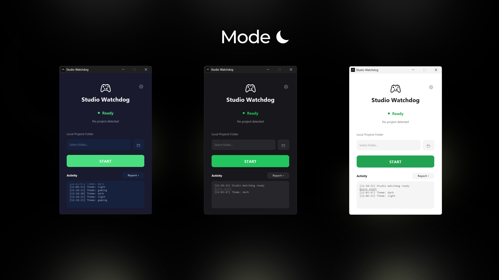

# Studio Watchdog

Automatically reopens your last Roblox Studio project after crashes.

  <a href="https://github.com/Egestic1111/studio-watchdog/releases/latest">
    <b>Download latest (StudioWatchdog.exe)</b>
  </a>

  

## What It Does
- Monitors `RobloxStudioBeta.exe`
- After a crash, reopens the last project:
  - Local `.rbxl/.rbxlx` from your selected folder
  - Cloud places via `placeId`
- Tray status:
  - Green = idle
  - Red = monitoring

## Quick Start
1. Choose your local projects folder
2. Click `START`
3. Keep Studio open; crashes reopen your last project

## How It Works
- A Roblox Studio plugin sends the current project context to a local API
- Local API is bound to `127.0.0.1` only

## Themes
Studio Watchdog includes 3 built-in themes:
- Light
- Dark
- Gaming

  

## Licensing
- Free auto-restarts: 6 per device
- License term: 90 days from first activation
- License is verified online (24-hour grace period if the server is temporarily unreachable)

## Bug Reports (Opt-In)
- `Activity -> Report -> Send report` sends a diagnostic report only when you click it

## Verify the Download (SHA256)
To verify the file was not corrupted or replaced, check its SHA256 hash.

1. Open PowerShell in the folder with `StudioWatchdog.exe`
2. Run:
   `Get-FileHash .\StudioWatchdog.exe -Algorithm SHA256`
3. Compare the `Hash` value with the SHA256 listed in the release

StudioWatchdog.exe: 434705ECCEE8C4E55AB19CEBA8787DB81FA4524E3FF0357987AF8AE09E9911E0

## Disclaimer
Not affiliated with Roblox.
